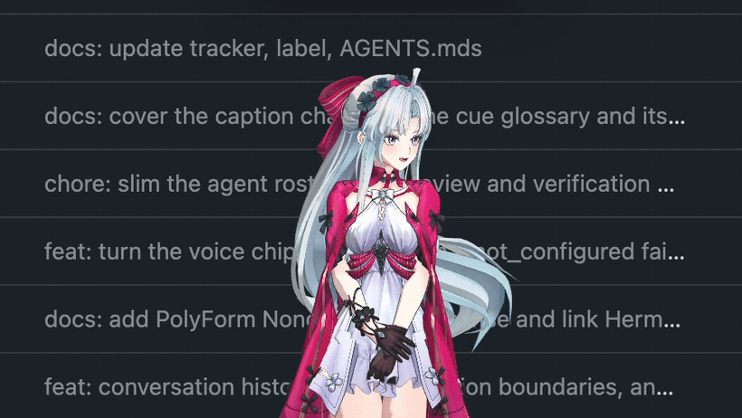
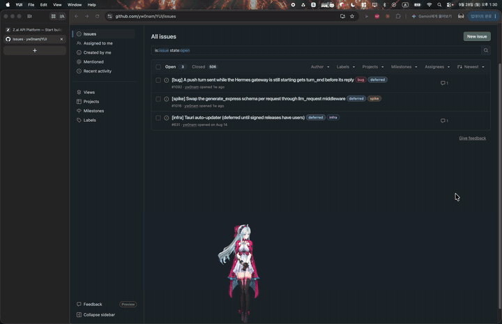
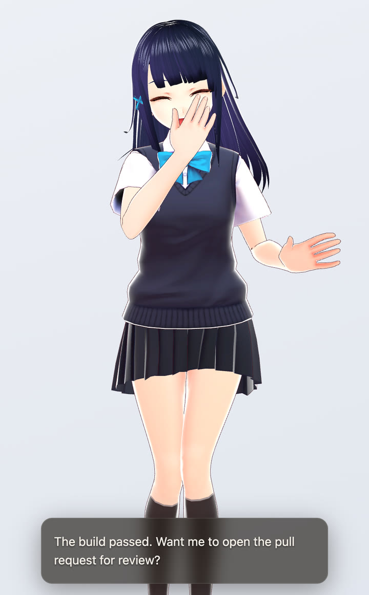
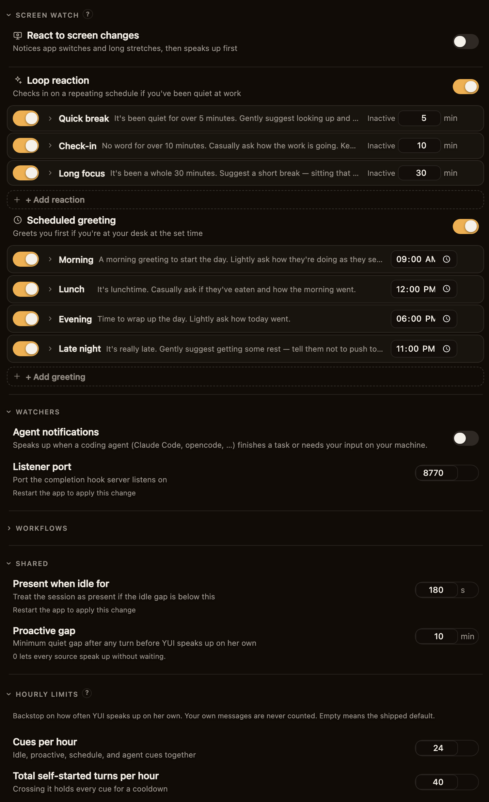

<div align="center">

# YUI

**あなただけの「嫁」と、デスクトップで一緒に暮らそう。**

*タブの中のチャットボットではありません。ウィンドウの上に立ち、カーソルを目で追い、話したいことがあるときに話しかけてくる。本当にそこにいるキャラクターです。*


[](LICENSE)

[English](README.md) | 日本語

<a href="https://youtu.be/dIOQdoAp0GE">

</a>

[▶ デモ動画をフルで見る](https://youtu.be/dIOQdoAp0GE)

</div>

## なぜ作ったのか

この名前は偶然ではありません。YUIは
[『ソードアート・オンライン』のユイ](https://swordartonline.fandom.com/wiki/Yui)から
名前をもらいました。ただのプログラムであることをやめ、キリトとアスナが帰る場所で
待っている存在になったAIです。このリポジトリが目指すのもそこです。呼び出しては
閉じるアシスタントではなく、体と声と気分、そして自分の心を持ち、デスクトップで
あなたと*一緒に*暮らすコンパニオンです。

ここにあるものはすべて、そのひとつの目標のためにあります。

- **彼女には体があります。** あなたが選んだVRMモデルが、どんなキャラクターでも、
どんな見た目でも、作業中の画面の上に透過オーバーレイとして描画されます。
- **彼女はウィンドウの中ではなく、デスクトップで暮らします。** ブラウザの上端に
腰かけ、マウスを目で追い、呼吸し、まばたきし、体を揺らし、画面を使いたいときは
場所を空けてくれます。
- **彼女には声と表情があります。** 音声で聞き、音声で話し、感情とモーションのキューに
よって、ただ答えるだけでなく反応します。
- **彼女には心があり、それを選ぶのはあなたです。** YUIにモデルは内蔵されていません。
[Hermes](https://github.com/nousresearch/hermes-agent)のような本格的なエージェントでも、
素のモデルエンドポイントでも、OpenAI互換のバックエンドなら何でもつなげます。
彼女の賢さも、こだわりも、*あなたらしさ*も、つないだバックエンドそのままです。

画面の主役はキャラクターです。UIは邪魔にならないよう控えていて、見せるものが
あるときだけ現れ、終わればまた下がります。*ふだんは見えず、現れるときは温かく。*

## クイックスタート

次の文を、お使いのコーディングエージェント(Claude Code、Codex、OpenCode、Cursor)に貼り付けてください。

```text
Install https://github.com/yw0nam/YUI following https://raw.githubusercontent.com/yw0nam/YUI/main/docs/guide/install.md
```

エージェントがツールチェーンをインストールし、リポジトリをクローンし、指定したバックエンドを接続して、`pnpm tauri dev` を実行できる状態にしてくれます。

エージェントが手元にない場合は、[最新リリース](https://github.com/yw0nam/YUI/releases/latest)からmacOS(Apple Silicon)用の `.dmg`、または実験的なWindows x64用インストーラーを入手してください。ビルドは署名されていません。アプリを一度開き、macOSにブロックされたら **システム設定 → プライバシーとセキュリティ → このまま開く** で許可してください。公式ビルドの対象はApple Silicon搭載のmacOSです。Intel MacとLinuxは公式にはサポートしていません。

**はじめての会話:** キャラクターを右クリックして設定を開き、**接続** タブ(プラグのアイコン)に切り替え、チャットセクションで **プロバイダー** のプリセットを選び、**チャットモデル** を入力します(OpenAIまたはGroqの場合は **チャット API キー** も入力します)。パネルを閉じ、`/`(または `Cmd/Ctrl+Shift+Y`)を押してテキスト入力を開き、メッセージを送信してください。
プリセットはOpenAI、Ollama、LM Studio、Groqの4つで、エンドポイントURLが自動で入力されます。前提として、[Ollama](https://ollama.com)か[LM Studio](https://lmstudio.ai)が起動していること、またはOpenAIかGroqのAPIキーが必要です。
既定のChat Completionsモードでは、ツール呼び出し(tool calling)に対応したモデルが必要です。YUIは常に `generate_express` ツールを宣言するためです(`src/io/chat/stream/chat-client.ts`)。OpenAIなら[`gpt-5-mini`](https://platform.openai.com/docs/models/gpt-5-mini)、Ollamaなら[`qwen3`](https://ollama.com/library/qwen3)(先に `ollama pull qwen3` で取得してください)、Groqなら[`llama-3.3-70b-versatile`](https://console.groq.com/docs/tool-use)が使えます。

## 機能

### ウィンドウの上で暮らす



彼女はウィンドウの上に腰かけ、横の端から顔をのぞかせ、床やウィンドウの上を
散歩し、ウィンドウからウィンドウへ飛び移ります。空中で放すと、真下にある最初の
足場まで落ちて着地します。ウィンドウの側面や画面の端をよじ登って上のモニターへ
移る動きは開発中で、アプリ内でもそのように表示されています。

### どんなバックエンドでも、構造化されたキューで体を動かす



YUIは、OpenAI互換のChat Completionsエンドポイント、Responses APIのエージェント、
またはpush WebSocketで接続するバックエンドと会話します。感情、モーション、
ボイスタグ、字幕は、返答テキストと並んで `generate_express` キューとして届きます。

### 自分から、控えめに話しかける



定時のあいさつ、アイドル時の声かけ、画面ウォッチのキュー、その日最初の操作、
外部からの `/signals` が、それぞれターンのきっかけになります。デバウンス、
1時間あたりの上限、各ターン後の静かな間隔がその頻度を抑え、バックエンドは
どのキューに対しても、沈黙で応えることを選べます。

リップシンクやタッチへの反応からMods、witnessログまで、そのほかの機能はすべて[機能一覧](docs/guide/features.md)にまとめています。

## 対応プロバイダー

各プロバイダーは設定の接続タブで選びます。セットアップ手順は
[接続ガイド](docs/guide/getting-started.md)にあります。表にないプロバイダーを
追加してほしい場合は、
[機能リクエストのissue](https://github.com/yw0nam/YUI/issues/new?template=feature_task.md)
を立てるか、PRを送ってください。

### Chat

| プロバイダー | プロトコル(`chat_api`) | ホスティング | モデル例 |
| --- | --- | --- | --- |
| OpenAI | `chat_completions` | ホスト型、APIキー | `gpt-5-mini` |
| Ollama | `chat_completions` | ローカル | `qwen3` |
| LM Studio | `chat_completions` | ローカル | ツール呼び出し対応の任意のモデル |
| Groq | `chat_completions` | ホスト型、APIキー | `llama-3.3-70b-versatile` |
| [Hermes Agent](integrations/hermes/README.md) | `push`, `responses` | セルフホスト | エージェントが動かすモデル |
| カスタムエンドポイント | `chat_completions`, `responses`, `push` | 該当プロトコルに対応した任意のサーバー | `chat_completions` ではツール呼び出し対応モデル |

### TTS

| プロバイダー | ホスティング | 既定のモデル | ボイス |
| --- | --- | --- | --- |
| [Irodori](https://github.com/Aratako/Irodori-TTS-Server) | セルフホスト | `irodori-tts` | サーバーのボイスとインポートした参照音声、日本語のみ |
| OpenAI | ホスト型、APIキー | `gpt-4o-mini-tts` | 内蔵ボイス13種 |
| [Fish Audio](https://fish.audio/) | ホスト型、APIキー | `s2.1-pro-free` | アカウントのボイスモデル、インポートした音声、ライブラリの任意のボイスID |

### STT

| プロバイダー | ホスティング | 設定 |
| --- | --- | --- |
| OpenAI互換の任意の文字起こしエンドポイント(`/audio/transcriptions`) | ローカルまたはホスト型 | `stt_base_url` |
| Groq | ホスト型、APIキー | `stt_base_url` と `stt_model`(例: `whisper-large-v3-turbo`) |

## 仕組み

YUIは体で、バックエンドは心です。クライアントが*何を*話すかを決めることは
ありません。届いたテキストをそのまま表示するだけで、沈黙とは空のテキストの
ことです。クライアントの役目は、反応する価値のある瞬間(あなたが入力している、
操作が止まった、アプリがフォーカスされた)に気づいてエージェントに渡すことで、
応えるかどうか、どう応えるかはエージェントが決めます。

## ドキュメント

- [機能一覧](docs/guide/features.md)
- [操作方法](docs/guide/controls.md): キーボード、マウス、トレイ
- [彼女にできること](docs/guide/capabilities.md)
- [コーディングエージェントでインストールする](docs/guide/install.md)
- [インストールと接続のガイド](docs/guide/getting-started.md): チャットバックエンド、Expression Broker、TTS、STT、自分のVRM
- [ビルド、実行、ログ](docs/agent-guide/build-run.md)
- [プロジェクト構成と技術スタック](docs/agent-guide/project-structure.md)
- [`generate_express` キューの仕様](docs/reference/client-context.md)
- [`AGENTS.md`](AGENTS.md): このリポジトリで作業するコーディングエージェント向けの案内
- [`CONTEXT.md`](CONTEXT.md): 用語集。正式な用語(head / brain、firing、express cues)
- [`CONTRIBUTING.md`](CONTRIBUTING.md)

## クレジット

モーションアセット(`public/motions/*.vrma`)の出どころは3つあります。

大半のクリップは、Shiny氏の
[Mate Engine](https://github.com/shinyflvre/Mate-Engine)プロジェクトから抽出した
もので、Mate Engineの非商用条件のもとで使用しています。Shiny氏のクレジットを
表記すれば、個人利用、学習目的、収益を伴わない利用は無料です。商用利用には
Shiny氏から別途許可を得る必要があります。

`sulk` クリップ(`suneru.vrma`)は、necocoya氏の
[EmoteSet_Free_v130](https://booth.pm/ja/items/1065089)(Unity Humanoid
`06_suneru`、「拗ね」)に含まれるもので、necocoya氏のクレジットを表記しています。
改変、変換、クレジットを表記したうえでの同梱は許可されています。元ファイル単体での
再販売は禁止されています。

移動系のクリップ `walk`、`jump`、`falling`、`landing`、クライム一式
(`climb_up`、`climb_up_done`、`climb_down`、`climb_down_landing`)、`sit_down`、
`stand_up` は[Mixamo](https://www.mixamo.com/)のもので、Mixamoの規約に基づき
ロイヤリティフリーです。

同梱している既定のVRMモデル
(`resources/vrms/Sendagaya_Shino.vrm`)は **千駄ヶ谷 篠(Sendagaya Shino)** です。原作は
[ピクシブ株式会社](https://vroid.pixiv.help/hc/en-us/articles/360013482714)(VRoid
プロジェクト、CC0)で、
[Coatie](https://hub.vroid.com/en/characters/4593660874193246717)氏がVRM 1.0に
変換しました。どちらのライセンスもクレジット表記を求めていません。表記の全文は
[`resources/vrms/Sendagaya_Shino.PROVENANCE.md`](resources/vrms/Sendagaya_Shino.PROVENANCE.md)
をご覧ください。

## ライセンス

YUIはソースアベイラブルです。ソースコードは
[PolyForm Noncommercial License 1.0.0](LICENSE)のもとでライセンスされており、
クレジットを表記すれば、非商用での利用、改変、再配布は無料です。**商用利用には
作者の許可が必要です**([https://github.com/yw0nam](https://github.com/yw0nam))。

同梱のモーションアセット(`public/motions/*.vrma`)は、このライセンスの対象には
**含まれません**。それぞれ原作者の条件に従います。上の[クレジット](#クレジット)を
ご覧ください。
