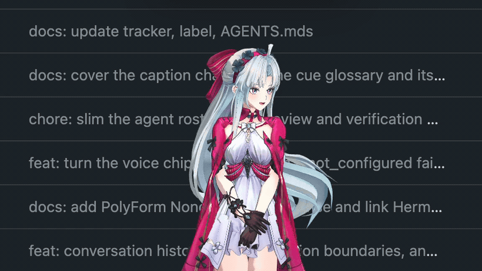

<div align="center">

# YUI

**Make your own waifu live on your desktop.**

*Not a chatbot in a tab. A character who is actually there — standing on your window, watching the cursor, talking when she has something to say.*


<a href="https://youtu.be/dIOQdoAp0GE">

</a>

[▶ Watch the full demo](https://youtu.be/dIOQdoAp0GE)

</div>

## Why this exists

The name is not an accident. YUI is named after
[Yui from *Sword Art Online*](https://swordartonline.fandom.com/wiki/Yui) — an
AI who stopped being a program and became someone Kirito and Asuna came home
to. That is the destination of this repo: a companion who lives *with* you on
your desktop, with a body, a voice, moods, and a mind of her own — not an
assistant you summon and dismiss.

Everything here serves that one goal:

- **She has a body.** A VRM model you choose — any character, any look — rendered
in a transparent overlay on top of whatever you are doing.
- **She lives on the desktop, not in a window.** She perches on the top edge of
your browser, follows the mouse with her eyes, breathes, blinks, sways, and
moves out of the way when you need the screen.
- **She has a voice and a face.** Speech in, speech out, and emotion/motion cues
that make her react instead of just answer.
- **She has a mind, and you pick it.** YUI ships no embedded model. Bring any
OpenAI-compatible backend — a full agent like
[Hermes](https://github.com/nousresearch/hermes-agent) or a bare model
endpoint — and she is exactly as smart, as opinionated, and as *yours* as what
you plug in.

The character owns the screen; chrome stays out of the way and only appears when
there is something to show, then steps back. *Invisible by default, warm when
present.*

## Quickstart

No dev tools needed — download, open, connect:

1. **Download** — grab the [latest release](https://github.com/yw0nam/YUI/releases/latest):
 the macOS (Apple Silicon) `.dmg`, or the experimental Windows x64 installer.
2. **Open** — builds are unsigned, so macOS blocks the first launch: right-click
 the app → **Open**, and if it still refuses, allow it under **System
 Settings → Privacy &amp; Security → Open Anyway**.
3. **Connect** — the character appears with no backend attached and tells you
 where to go: right-click her, open **Advanced**, and point YUI at any
 OpenAI-compatible endpoint (base URL, model, API key). Then start talking.

Voice in/out are optional add-ons — see the
[install guide](docs/guide/getting-started.md) for TTS/STT and the full backend
wiring.

## Features

**Agent**

- Two chat protocols, selected by `chat_api` in `configs/endpoints.json`: a
backend agent honoring YUI's expression contract over the OpenAI Responses
API, or any tool-calling OpenAI-compatible Chat Completions endpoint — no
fixed embedded model
- Emotion, motion, and voice cues arrive as structured `generate_express`
tool-calls, never as inline tags in the text — in both chat modes
- YUI publishes its emotion/motion/voice vocabulary to the Expression Broker
(MCP) in both chat modes, write-only and gated only on `broker_base_url`;
a backend agent reads it back via `get_ids` and emits cues as
`generate_express` tool-calls
- In Chat Completions mode YUI declares `generate_express` itself, with that
same vocabulary in the tool schema, runs the call locally and returns the
result — expression on a bare model endpoint, no broker required

**Voice &amp; chat**

- Speech input — Silero VAD + ONNX segment your voice, then an
OpenAI-compatible endpoint transcribes it
- Speech output — sentence-queued TTS with ordered playback and per-sentence
voice cues
- Amplitude lipsync drives the mouth from audio, with a user gain slider
- Streaming, markdown-rendered speech bubble that fades in only when she speaks

**Desktop pet**

- Sits on the top edge of a window and detaches when the window moves, closes,
or gets covered
- OS-native dragging on a transparent, always-on-top, multi-monitor overlay
- Idle liveliness — blink, sway, breathing, and look-around run locally even
with no backend connected, and respect `prefers-reduced-motion`
- Reads OS-wide idle time and an optional user-toggled screenshot and feeds
them to the agent each turn; the frontmost app/window is a pull tool the
agent calls via the `desktop-control` Mod, not a per-turn push

**Rendering &amp; motion**

- VRM 1.0 with hot-swap and GPU cleanup, via three.js + `@pixiv/three-vrm`
- 10 emotions and 16 motions, with a fallback chain for models that lack an
expression
- Idle and sit cycle through pools of motion clips with smooth transitions
- Camera auto-frames the avatar, with wheel zoom and a pull-back when perched

**Platform**

- UI in English, 日本語, and 한국어, with a persisted locale
- Endpoints, models, VRM paths, and motion sets all live in `configs/` — nothing
is hardcoded
- macOS-first; Windows x64 builds are experimental

## How it works

YUI is the body; the backend is the mind. The client never decides *what* to
say — it renders whatever text arrives, and silence is just empty text. What the
client does is notice moments worth reacting to (you typing, going idle, an app
coming to focus) and hand them to the agent, which decides whether and how to
respond.

Cues ride alongside the reply. Speech comes through as a normal assistant text
stream, while emotion, motion, and voice tags arrive as `generate_express`
tool-calls with flat arguments
`{ emotion_id?, motion_id?, emotion_text?, caption? }`.
`emotion_text` is a TTS voice tag drawn from the emoji vocabulary the Expression
Broker publishes so the agent knows what it can ask for. Both chat modes carry
them; see [Backend wiring](#backend-wiring) for how the transport differs by
chat protocol and backend. The full cue contract handed to the
backend lives in [`docs/reference/client-context.md`](docs/reference/client-context.md).

## Stack


| Layer              | Technology                                       | Version |
| ------------------ | ------------------------------------------------ | ------- |
| Shell / OS         | Tauri v2 (Rust)                                  | 2.11.x  |
| Build / dev server | Vite                                             | 8.x     |
| Language           | TypeScript                                       | 6.x     |
| Render             | three.js                                         | 0.180.x |
| VRM / motion       | `@pixiv/three-vrm`, `@pixiv/three-vrm-animation` | 3.5.x   |
| Voice              | `@ricky0123/vad-web` (Silero + ONNX)             | 0.0.x   |


## Building from source

Using Claude Code? Open the repo and type `/yui-install` — the skill checks
prerequisites, installs, verifies the build, and writes any wiring you want.
Manual steps follow.

**Prerequisites**

- Node + [pnpm](https://pnpm.io/)
- Rust + the [Tauri v2](https://v2.tauri.app/start/prerequisites/) toolchain

**Commands**

```bash
pnpm install
pnpm dev                    # Vite dev server (port 1420), browser only
pnpm tauri dev              # Tauri app (port 1420), transparent pet window
pnpm dev:auto               # browser only, auto-picks a free port from 1420 up
pnpm tauri:dev              # Tauri app, auto-port — lets worktrees run side by side
pnpm build                  # tsc + vite build
pnpm test                   # vitest run
cd src-tauri && cargo test  # Rust unit tests
```

**Runtime assets.** A default VRM (`resources/vrms/Sendagaya_Shino.vrm`) ships
in the repo, so a fresh checkout runs as-is. Extra models under `resources/vrms/`
and `.env.local` (`VITE_YUI_CHAT_KEY`, optional — the in-app key field works
too) are gitignored; `scripts/worktree-setup.sh` links the VRMs and copies
`.env.local` into a new worktree.

For the backend services and full wiring, see [`docs/guide/getting-started.md`](docs/guide/getting-started.md).

## Backend wiring

Chat, STT and TTS use the OpenAI-compatible API; the Expression Broker is an MCP
server. Each is a separate, config-swappable process, and all base URLs live in
`configs/endpoints.json`.

- **Chat protocol** — selected via `chat_api` (default `chat_completions`):
  - `responses` — routes to a backend agent (Hermes recommended) over
  `/v1/responses` (e.g. `localhost:8643`)
  - `chat_completions` — connects over the Chat Completions API to any
  tool-calling OpenAI-compatible endpoint; the client declares
  `generate_express` with its own vocabulary, executes the call and returns
  the result, and keeps the conversation transcript client-side (no
  `previous_response_id`), trimmed to `chat_model_context_window`
  
  | Mode               | Speech text | `generate_express` cues                                             |
  | ------------------ | ----------- | ------------------------------------------------------------------- |
  | `responses`        | yes         | yes — the backend agent emits them as function-call items           |
  | `chat_completions` | yes         | yes — the client declares the tool, runs it, and returns the result |
  

  Backend capability still varies: a plain OpenAI-compatible server (e.g.
  vLLM) speaks standard Chat Completions tool-call streaming, while the
  Hermes api-server's `/v1/chat/completions` never surfaces tool calls — it
  emits a custom `hermes.tool.progress` telemetry event with no arguments
  instead. With Hermes, use `responses` mode for cues.
- **STT** — `<stt_base_url>/audio/transcriptions` (e.g. `localhost:5517/v1`)
- **TTS** — OpenAI-compatible `/v1/audio/speech` (e.g. `localhost:8088`), with
`model` from `tts_model` and `voice` from the speaker picked in the panel.
The TTS server is the source of truth for the speaker list
(`GET /v1/audio/voices`) — users add their own via the panel's import button,  
which uploads the clip to `/v1/audio/voices`. [Irodori TTS Server](https://github.com/Aratako/Irodori-TTS-Server)
is the recommended server for Japanese TTS.
- **Expression Broker** — streamable-http MCP (e.g. `localhost:3201/mcp`); YUI
publishes its emotion/motion/voice vocabulary here in both chat modes,
gated only on `broker_base_url` (skipped if unset) — the backend agent
behind either endpoint reads it back via `get_ids`

The client calls STT and TTS directly — they do not route through Hermes.

## Project layout

```
YUI/
  configs/                # Runtime config: endpoints, emotion + motion registries, voice vocab, avatar, hotkeys, screen, guardrails, filler
  resources/vrms/         # VRM models — bundled default + your own (gitignored)
  public/motions/         # VRMA motion assets
  public/vad/             # Silero VAD + ONNX runtime assets
  scripts/                # dev-port / worktree helpers
  src/
    contract/             # TS contract types — source of truth
    renderer/             # three.js + VRM: load, emotion resolver, motion controller, lipsync
    io/                   # chat, tts, stt, os-context, screenshot, broker
    dispatcher/           # Event bus + classify → route
    ambient/              # Local idle liveliness (blink / sway / breath)
    config/               # Config load, validate, hot-reload
    ui/                   # Speech bubble, input, tool-status surfaces
  src-tauri/src/
    drag.rs               # OS-native window drag
    passthrough.rs        # Click-through over transparent pixels
    screenshot.rs         # Monitor capture
    tray.rs               # System tray
    agent_ingress.rs      # Loopback /signals ingress: coding-agent hooks + remote signal batches
    vrm_import.rs         # Bring-your-own VRM copy into app data
    voice_import.rs       # Reference-clip import for TTS voices
    os_event_watcher/     # Idle / frontmost polling (macos · windows)
  tests/                  # Non-colocated Vitest suites (scripts, hooks, CI); the rest sit beside src/
  docs/                   # Backend contract + human-facing catalogs
  Mods/                   # Standalone MCP servers, independent of the app
```

Optional standalone **Mods** — independent MCP servers that extend the backend
agent: `desktop-control` (screen, activity log, app launch/quit), `avatar`
(body state + semantic moves), `shell-sandbox`, and a `router` front door —
live under [`Mods/`](Mods/README.md), separate from the app runtime.

## Logs

Frontend and Rust logs merge into one file via `tauri-plugin-log`. Frontend
lines come from `src/logger.ts` (`[YUI][namespace] …`); Rust lines use the `log`
crate.

- **Dev** — `<repo>/logs/` (gitignored). Tail with `tail -f logs/*.log`.
- **Release (macOS)** — `~/Library/Logs/com.yui.desktop/`.

Default level is `debug` in dev and `warn` in release; override the frontend
level with `VITE_YUI_LOG_LEVEL` (`debug` · `info` · `warn` · `error`).

## Documentation

- [`AGENTS.md`](AGENTS.md) — project orientation (architecture, core principle, doc index); development work rules and the delegation model live in the `yui-dev-workflow` skill
- [`PRODUCT.md`](PRODUCT.md) / [`DESIGN.md`](DESIGN.md) — product register + design system
- [`docs/guide/getting-started.md`](docs/guide/getting-started.md) — install and wiring (broker · agent · TTS · STT · VRM)
- [`docs/reference/client-context.md`](docs/reference/client-context.md) — the `generate_express` cue contract
- [`docs/reference/motions.md`](docs/reference/motions.md) — motion catalog
- [`docs/reference/tts-emotion/`](docs/reference/tts-emotion/) — the `emotion_text` voice-tag vocabulary
- [`docs/reference/logging.md`](docs/reference/logging.md) — logging convention
- [`src/contract/types.ts`](src/contract/types.ts) — TS contract shapes

## Credits

The motion assets (`public/motions/*.vrma`) come from three sources.

Most clips are extracted from the
[Mate Engine](https://github.com/shinyflvre/Mate-Engine) project by Shiny, used
under Mate Engine's non-commercial terms: free for personal, study, and
non-revenue use with attribution to Shiny; commercial use requires separate
permission from Shiny.

The `sulk` clip (`suneru.vrma`) is from necocoya's
[EmoteSet_Free_v130](https://booth.pm/ja/items/1065089) (Unity Humanoid
`06_suneru`, 拗ね = sulk/pout), attribution to necocoya. Modification, conversion,
and bundling-with-credit are permitted; standalone resale of the raw file is
prohibited.

The `falling` and `landing` clips (`falling_loop.vrma`, `landing.vrma`) are
original works authored in Blender by the project author.

The bundled default VRM model
(`resources/vrms/Sendagaya_Shino.vrm`) is **Sendagaya Shino**, originally by
[pixiv Inc.](https://vroid.pixiv.help/hc/en-us/articles/360013482714) (VRoid
Project, CC0), converted to VRM 1.0 by
[Coatie](https://hub.vroid.com/en/characters/4593660874193246717). Neither
license requires attribution — see
[`resources/vrms/Sendagaya_Shino.PROVENANCE.md`](resources/vrms/Sendagaya_Shino.PROVENANCE.md)
for the full notice.

## License

YUI's source code is licensed under the
[PolyForm Noncommercial License 1.0.0](LICENSE) — free for noncommercial use,
modification, and redistribution with attribution. **Commercial use requires
permission from the author** ([https://github.com/yw0nam](https://github.com/yw0nam)).

The bundled motion assets (`public/motions/*.vrma`) are **not** covered by this
license; each follows its original author's terms — see [Credits](#credits) above.