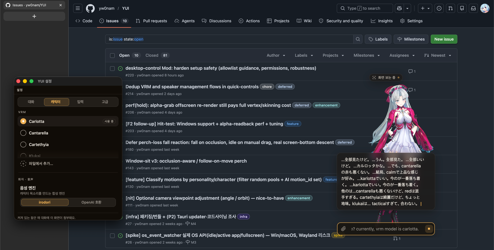

<div align="center">

# YUI

**Embodied VRM frontend (head) for the Hermes Agent (brain).**

*invisible-by-default, warm-when-present*

[](https://github.com/yw0nam/YUI/actions/workflows/ci.yml)




</div>

## What it is

YUI is a VRM desktop-pet that renders the persona supplied by the Hermes Agent
backend. It is the **head** — VRM character rendering, desktop-pet behavior, and
I/O surfaces (text · voice · screen) — while all judgment, persona, memory, and
the agent loop are delegated to Hermes (the **brain**). Its UI is
invisible-by-default and warm-when-present (see [`PRODUCT.md`](PRODUCT.md)): the
character owns the stage, and chrome surfaces only when it has something to say,
then steps back.

## Features

> YUI is the body for a real agent. Rather than embedding a small on-device LLM, it renders the character and delegates the mind to any backend that speaks the OpenAI Responses API and honors its expression contract — so the character is as capable as the agent behind it.

**🧠 Agent Integration**

| Capability | What it does |
|---|---|
| Pluggable agent backend | Drives the character from any OpenAI Responses-API backend that honors the contract — not a fixed embedded LLM |
| Structured expression contract | Speech + `emotion_id` / `motion_id` / `emotion_text` cues arrive as `generate_express` tool-calls, never inline tags |
| Expression Broker (MCP) | Publishes YUI's renderable emotion/motion/voice vocabulary so the backend learns what the body can express at runtime |
| Firing ≠ judgment boundary | Client fires candidate events (idle · OS-event · user); backend judges — no brain in the client |

**🎙️ Voice & Chat I/O**

| Capability | What it does |
|---|---|
| Voice input (STT + VAD) | Silero VAD + ONNX segments speech, OpenAI-compatible transcription |
| Voice output (TTS) | Sentence-queued pipeline, ordered playback, per-sentence emotion-text cue routing |
| Amplitude lipsync | RMS audio → mouth blendshape, user gain slider |
| Streaming speech bubble | Markdown-rendered, frosted, invisible-by-default surface |

**🖱️ Desktop-Pet Behavior**

| Capability | What it does |
|---|---|
| Window-sit / perch | Sits on a window's top edge, detaches on occlusion / move / close |
| OS-native drag | Transparent always-on-top overlay, multi-monitor DPI-aware |
| Tier-1 ambient (backend-independent) | Blink · sway · breath · look-around, `prefers-reduced-motion` compliant |
| OS context | Active-app / idle / fullscreen / optional screenshot fed to the agent per turn |

**🎨 Rendering & Motion**

| Capability | What it does |
|---|---|
| VRM 1.0 hot-swap | three.js + `@pixiv/three-vrm`, GPU cleanup on swap |
| 10 emotions / 15 motions | Existence-aware fallback chain, config-driven registries |
| Motion variant pools + ping-pong | Idle/sit cycle through clip pools with smooth dwell transitions |
| Fit-to-bounds camera | Auto-frames the avatar, wheel zoom, perch pull-back |

**🌐 Platform & Localization**

| Capability | What it does |
|---|---|
| Multi-language UI | English · 日本語 · 한국어, persistent locale |
| Config-driven everything | Endpoints, models, VRM paths, motion sets — no hardcoding |
| macOS-first | Full OS-event watching on macOS; **Windows partial** (`os_idle_ms` unavailable) |

## Architecture

The head/brain split rests on one principle: **firing ≠ judgment**. The client
*fires* candidate events (timer · idle-watcher · OS-event-watcher · user input);
the backend decides whether and what to speak. Silence is simply empty speech
text, and the client renders whatever text arrives — no brain lives in the
client.

Control signals ride server-side `generate_express` tool-calls on the
`/v1/responses` stream, with flat arguments `{ emotion_id?, motion_id?,
emotion_text? }` (`emotion_text` is a per-provider TTS voice tag whose
renderable vocabulary is published by the Expression Broker — emoji set for
irodori, free text for openai-compatible/fishspeech — which the agent learns
via the broker). Speech
text flows as a separate assistant text stream (`response.output_text.delta`),
not inside the tool-call. The renderable emotion/motion vocabulary is brokered
by the Expression Broker MCP; the `generate_express` cue contract handed to the
backend agent lives in [`docs/backend_contract.md`](docs/backend_contract.md).

## Stack

| Layer | Technology | Version |
|---|---|---|
| Shell / OS | Tauri v2 (Rust) | 2.11.x |
| Build / dev server | Vite (dev port `YUI_DEV_PORT`, default **1420**; auto-port launchers per worktree) | 8.x |
| Language | TypeScript (bundler mode, `noEmit`) | 6.x |
| Render | three.js | 0.180.x |
| VRM / motion | `@pixiv/three-vrm`, `@pixiv/three-vrm-animation` | 3.5.x |
| Voice | `@ricky0123/vad-web` (Silero + ONNX) | 0.0.x |

## Hermes integration

Chat and STT use the OpenAI-compatible API; TTS and the Expression Broker
depend on the selected provider. All are separate, config-swappable processes:

- **chat → Hermes Agent** — `localhost:8643` `/v1/responses`
- **STT** — `localhost:5517` `/audio/transcriptions`
- **TTS** — provider-selected via `tts_provider` (default `irodori`):
  - `irodori` — irodori_TTS at `irodori_base_url` (`localhost:8091`) `/synthesize`,
    not OpenAI-compatible, reference-voice based (per-speaker voices in `irodori_voices`)
  - `openai` — OpenAI-compatible `/audio/speech` at `tts_base_url` (`localhost:8092`)
- **Expression Broker** (config-driven) — `broker_base_url` (`localhost:3201/mcp`,
  streamable-http MCP); YUI publishes the renderable emotion/motion/emotion_text
  vocabulary, the agent reads it (publish skipped if unset)

The client calls STT and TTS directly (they do not route through Hermes). The
base URLs all live in `configs/endpoints.json` — no hardcoding.

## Project structure

```
YUI/
  index.html              # Vite entry
  vite.config.ts          # dev port YUI_DEV_PORT|1420, strictPort, host 127.0.0.1
  scripts/                # Dev launchers: dev-port.mjs (resolver) + tauri-dev.mjs / dev-auto.mjs (auto-port)
  configs/                # Runtime-loaded config (endpoints, emotion + motion registries, avatar, per-provider emotion_text vocab)
  public/motions/         # VRMA motion assets
  src/
    main.ts               # Bootstrap wiring
    contract/             # TS contract types — source of truth
    renderer/             # three.js + VRM (load, emotion resolver, motion controller, lipsync)
    io/                   # chat-client, tts-pipeline, stt-vad, os-context, screenshot, broker-client, irodori-synth
    dispatcher/           # Event bus + classify → route spine
    ambient/              # Tier-1 blink / sway / breath (backend-independent)
    config/               # Config load + validate + reactive store + hot-reload
    ui/                   # Interaction surfaces (speech bubble, input, tool-status)
  src-tauri/
    src/
      lib.rs main.rs      # Tauri app + IPC
      drag.rs             # OS-native window drag
      screenshot.rs       # Monitor capture
      os_event_watcher/   # mod · macos · windows — active app / idle / fullscreen polling
  docs/                   # Backend-handoff contract + human-facing catalogs
  Mods/                   # Standalone MCP servers, independent of the app — Python/uv, own `mods` CI
```

Optional standalone **Mods** — independent MCP servers that extend the backend agent
(e.g. `desktop_control` for macOS screen capture + app launch/quit) — live under
[`Mods/`](Mods/README.md), separate from the app runtime.

## Getting started

### Prerequisites

- Node + [pnpm](https://pnpm.io/)
- Rust + the [Tauri v2](https://v2.tauri.app/start/prerequisites/) toolchain

### Commands

```bash
pnpm install
pnpm dev                    # Vite dev server (fixed port 1420) — browser only
pnpm tauri dev              # Tauri app (fixed port 1420, transparent pet window)
pnpm dev:auto               # Vite dev server, browser only — auto-picks a free port from 1420 up (or honors YUI_DEV_PORT)
pnpm tauri:dev              # Tauri app — auto-picks a free port from 1420 up (or honors YUI_DEV_PORT); enables concurrent worktrees
pnpm build                  # tsc + vite build
pnpm test                   # vitest run
cd src-tauri && cargo test  # Rust unit tests
```

### Runtime assets

The VRM model (`resources/vrms/*.vrm`) and `.env.local`
(`VITE_YUI_CHAT_KEY`) are gitignored, so a fresh checkout or worktree must
provide them itself — link/copy them from an existing checkout before running.
Vite serves `/vrms/*` from `resources/vrms`; without the VRM the model 404s and
without `.env.local` chat auth is absent.

For backend services (broker · agent · TTS · STT) and full wiring, see [`docs/setup.md`](docs/setup.md).

## Logs

Frontend and Rust logs are merged into a single file via `tauri-plugin-log`.
Frontend lines come from a central logger (`src/logger.ts` —
`createLogger("namespace")`, formatted `[YUI][namespace] …`); Rust lines use the
`log` crate macros. Both streams write to the same file.

- **Dev** (`pnpm tauri dev`) — `<repo>/logs/` (gitignored). Tail with:

  ```bash
  tail -f logs/*.log
  ```

- **Release** (built app, macOS) — `~/Library/Logs/com.yui.desktop/`.

Default level is `debug` in dev and `warn` in release. Override the frontend
level with the `VITE_YUI_LOG_LEVEL` env var (`debug` · `info` · `warn` · `error`).

## Documentation

- [`AGENTS.md`](AGENTS.md) — canonical agent guide (work rules, roster, stack, layout)
- [`PRODUCT.md`](PRODUCT.md) / [`DESIGN.md`](DESIGN.md) — product register + design system
- [`docs/setup.md`](docs/setup.md) — install and wiring guide (broker · agent · TTS · STT · VRM)
- [`docs/backend_contract.md`](docs/backend_contract.md) — `generate_express` cue contract handed to the backend agent
- [`docs/motions.md`](docs/motions.md) — motion catalog (every `configs/motions.json` id, playback policy, source clip)
- [`docs/tts_emotion/`](docs/tts_emotion/) — per-provider `emotion_text` voice-tag vocabulary
- [`docs/logging.md`](docs/logging.md) — logging convention (format, namespaces, levels)
- [`src/contract/types.ts`](src/contract/types.ts) — TS contract shapes (emotion · motion · control envelope · input context · endpoints)
- [`CHANGELOG.md`](CHANGELOG.md) — landed work

## Credits

The motion assets (`public/motions/*.vrma`) come from three sources.

Most clips are extracted from the
[Mate Engine](https://github.com/shinyflvre/Mate-Engine) project by Shiny.
They are used under Mate Engine's non-commercial terms: free for personal,
study, and non-revenue use with attribution to Shiny; commercial use requires
separate permission from Shiny.

The `sulk` clip (`suneru.vrma`) is from necocoya's
[EmoteSet_Free_v130](https://booth.pm/ja/items/1065089) (Unity Humanoid
`06_suneru`, 拗ね = sulk/pout), attribution to necocoya. Modification/conversion
and bundling-with-credit are permitted; standalone resale of the raw file is
prohibited.

The `falling` and `landing` clips (`falling_loop.vrma`, `landing.vrma`) are
original works authored in Blender by the project author.

## Status

YUI renders 10 emotions (existence-aware fallback) and 15 motions (idle, drag,
falling, landing, happy, laugh, embarrassed, sheepish, calm, peek, sleeping,
sulk, sit, window_sit, dance) with a Tier-1 ambient layer
(blink · sway · breath · look-around) and
amplitude-based lipsync. The dispatcher fires Tier-1 ambient client-side and
Tier-2 co-working proactive utterances (presence + 10-min cadence, settings
toggle default ON) through DND/debounce/rate-limit guards to the backend.
Chat, STT, TTS, and the Expression Broker are wired. Co-working is inert on
Windows, where `os_idle_ms` is unavailable.
